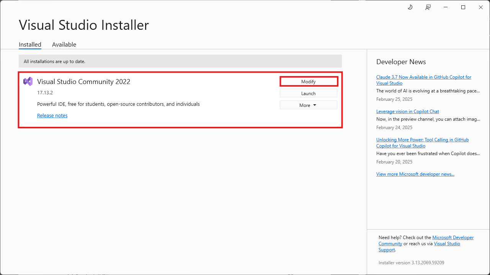
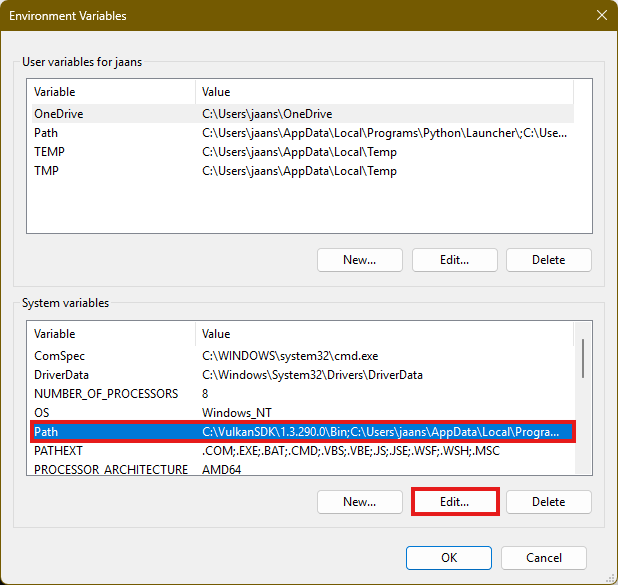
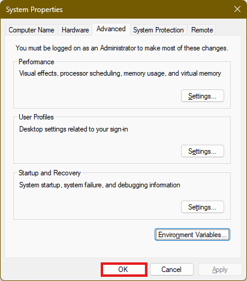
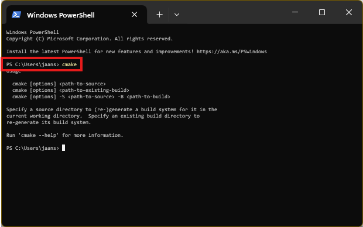

# Wildfire Simulator using Cadmium V2, Behave and QGIS

Table of Contents
1. [Installation Intructions](#1-installation-instructions)
    1. [Windows](#11-windows)
        1. [Git](#111-git)
        2. [Visual Studio](#112-visual-studio)
        3. [QGIS (Advanced Setup)](#113-qgis-advanced-setup)
    2. [Linux](#12-linux)

## 1. Installation Instructions

The widlfire simulator requires several dependencies:
- Git
- C++ compiler
- CMake
- QGIS

For detailed instructions on installing these dependencies, please navigate to the platform-specific installation section.

### 1.1 Windows

#### 1.1.1 Git

For instructions on installing Git, see the [Cadmium Installation Manual](cadmium_installation_manual.pdf)

#### 1.1.2 Visual Studio

1. Navigate to the following link and download the Community edition of Visual Studio: https://visualstudio.microsoft.com/downloads/


2. When the download finishes, run the installer and press "Continue"


3. Once the next download finishes, press "Modify"



4. Ensure "Desktop development with C++" is selected, then press "Install while downloading"


5. In the Windows search, type in "Environment Variables" and press "Edit the system environment variables"


6. Press "Environment Variables"


7. Under "System variables", press "Path" followed by "Edit"



8. Press "New" and enter the following path. Afterwards, press "Ok"
```
C:\Program Files\Microsoft Visual Studio\2022\Community\Common7\IDE\CommonExtensions\Microsoft\CMake\CMake\bin
```


9. Press "Ok"


10. Press "Ok"



11. To verify your installation, open any shell and type "cmake". You should see something like the following



#### 1.1.3 QGIS (Advanced Setup)

### 1.2 Linux

Todo

### Wildfire Simulator